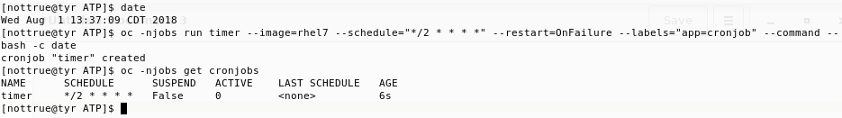
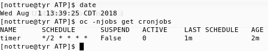
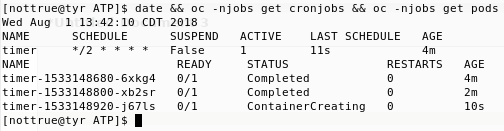
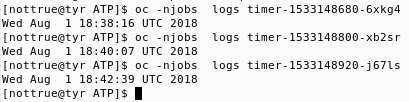
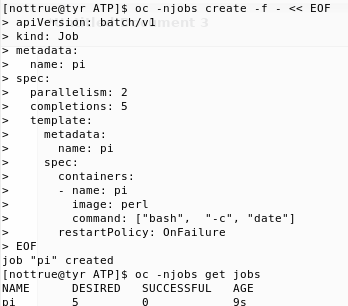
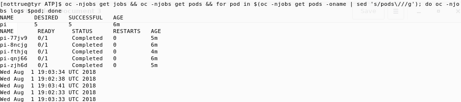

# CLI Way

## Cron jobs
Create a cronjob that will execute every two minutes:

After two minutes, the cron job will run for the first time\

After some more time, the job will run the expected amount of times

## One-shot jobs

Create a job definition that will spawn 5 pods, 2 at a time:\

after a while, the pods will be spawned and complete their task\

