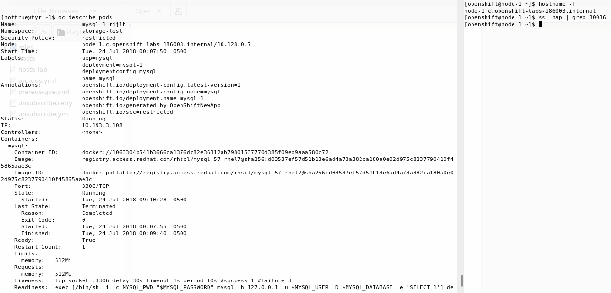
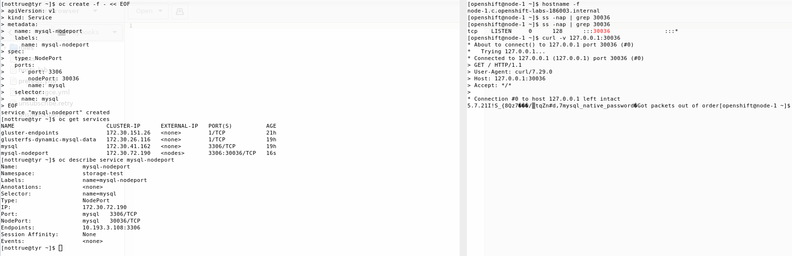

# CLI Way

Pod ports can be bound to host ports 30000-32767 by default using a NodePort service.

The nodeport service can be created using the following definition:

    oc create -f - << EOF
    apiVersion: v1
    kind: Service
    metadata:
      name: mysql-nodeport
      labels:
        name: mysql-nodeport
    spec:
      type: NodePort
      ports:
        - port: 3306
          nodePort: 30036
          name: mysql
      selector:
        name: mysql
    EOF

Before creating the nodeport service, the host where the pod is displayed is not listening on the service port:

After creating the node service, the host listens on the specified port

