# Web Way

Login to the OpenShift web console and select the appropriate project
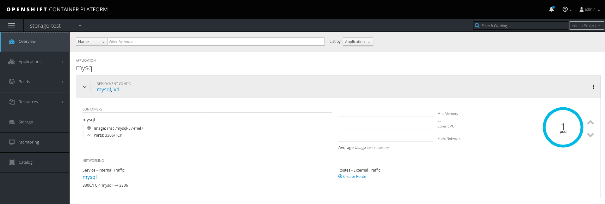

The application in question; in this case, a MySQL database instance, has an empty, ephemeral filesystem mounted on its data directory:
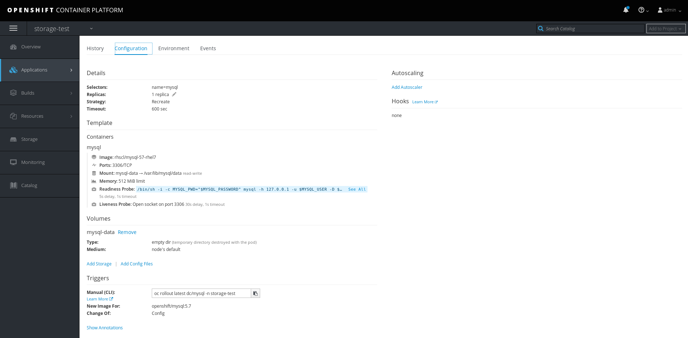
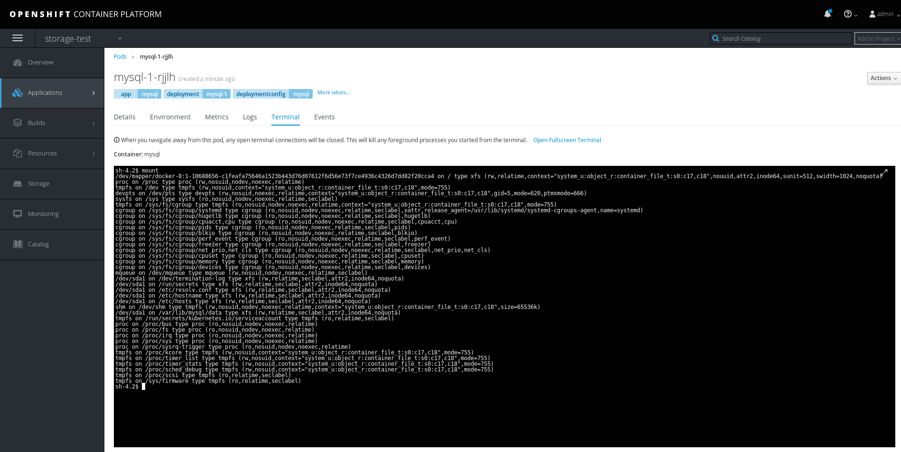

First, a PVC must be created to request a storage volume for the application. Clicking the **Storage** menu entry to the left displays the PVC summary and creation screen:
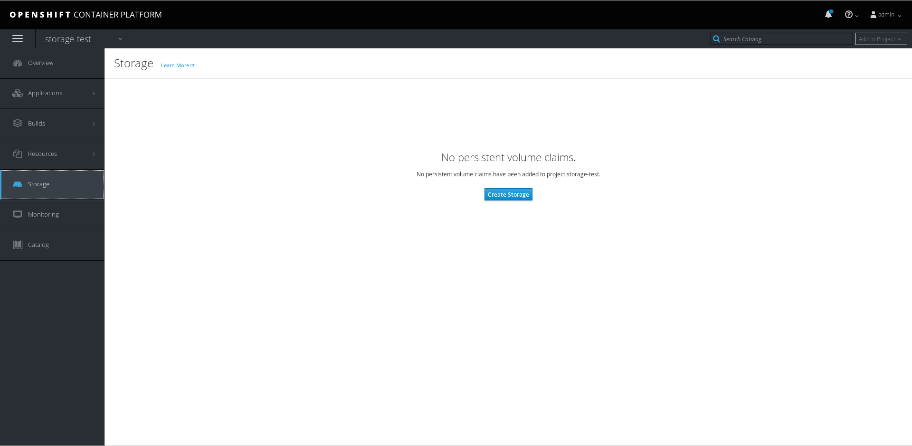

Clicking the **Create Storage** button shows the new storage screen:
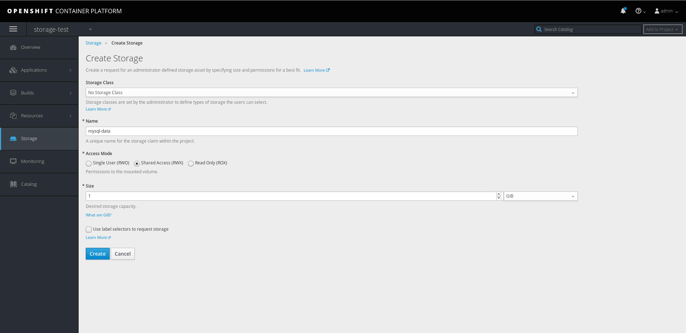

Once the storage is created, the storage summary screen shows the basic attributes of the PVC; namely, the **bound PV**, **capacity**, **access modes**, and **age**
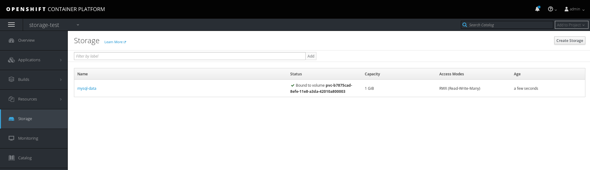

Next, the PVC must be configured to be mounted on the application.
Firstly, the former volume mount must be removed. Going back to the deployment config configuration screen, and clicking the **Remove** link under the volume mount description removes it.
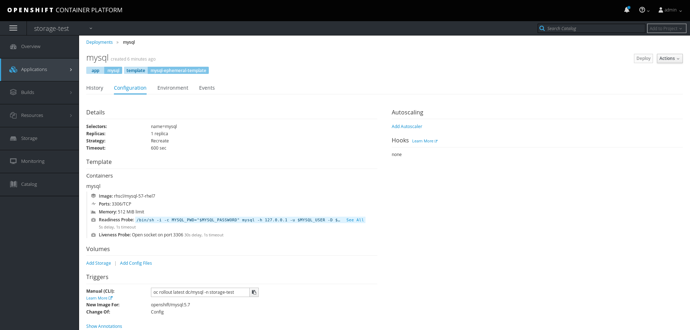

Then, clicking the **Add** link in the volume mount section displays the volume mount creation screen
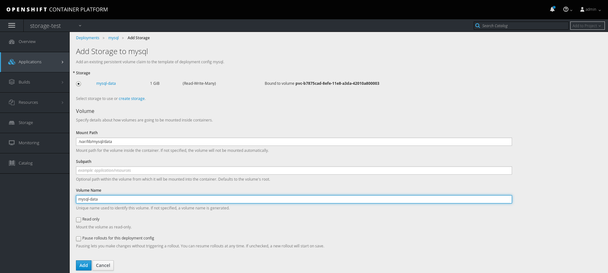

Clicking the **Add** button finishes the process, and the new volume mount is displayed in the deployment config configuration screen
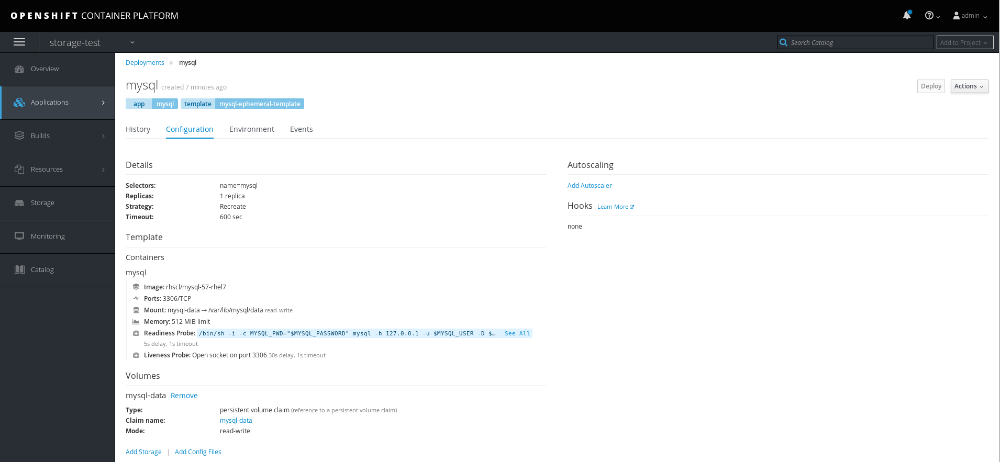

Running **mount** in the container console shows the gluster volume is now mounted
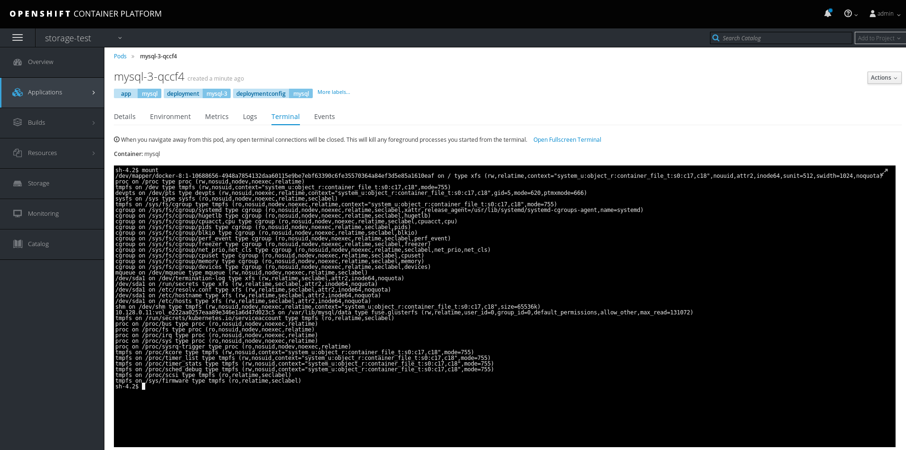

# CLI Way

Create the gluster volumes and the associated persistent volumes

    for volume in volume{1..10}; do 
    oc create -f - << EOF
    apiVersion: v1
    kind: PersistentVolume
    metadata:
      name: gluster-$volume
    spec:
      capacity:
        storage: 1Gi     
      accessModes:
      - ReadWriteMany    
      glusterfs:         
        endpoints: gluster-endpoints        
        path: $volume
        readOnly: false
      persistentVolumeReclaimPolicy: Recycle
    EOF
    oc -nglusterfs rsh $(oc -nglusterfs get pods -l"glusterfs=heketi-storage-pod" -oname | sed 's/pods\///g') bash -c "heketi-cli volume create --user=admin --secret=\$HEKETI_ADMIN_KEY --name=$volume --size=1 --gid=1000000100"
    done

The persistent volumes are correctly created and can be seen using **oc get pv**:
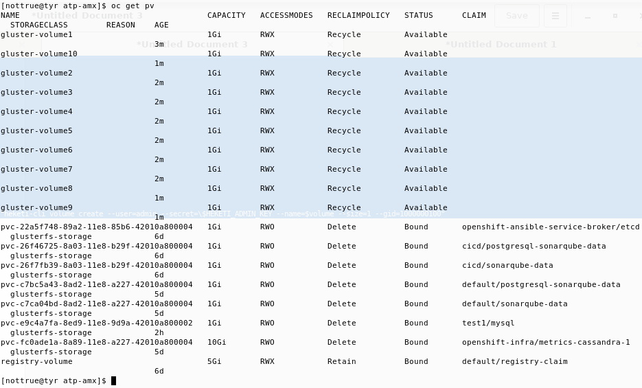

Create the project for the test and associated resources
    
    oc new-project storage-test
    oc patch ns/storage-test -p '{"metadata":{"annotations":{"openshift.io/sa.scc.supplemental-groups":"1000000000/1000"}}}'

    oc -nglusterfs export endpoints/heketi-db-storage-endpoints | sed 's/heketi-db-storage-endpoints/gluster-endpoints/g' | oc -nstorage-test create -f -
    oc -nglusterfs export services/heketi-db-storage-endpoints | sed 's/heketi-db-storage-endpoints/gluster-endpoints/g' | oc -nstorage-test create -f -

Create a PVC that will match the pod's storage requests with an underlying storage device
    
    oc -nstorage-test create -f - << EOF
    apiVersion: v1
    kind: PersistentVolumeClaim
    metadata:
      annotations:
      creationTimestamp: null
      name: mysql-data
    spec:
      accessModes:
      - ReadWriteMany
      resources:
        requests:
          storage: 1Gi
      storageClassName: ""
    EOF

The PVC is correctly created and can be observed using **oc get pvc**:
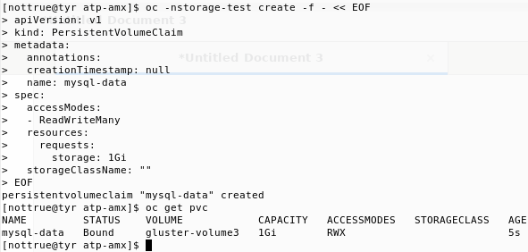

A PV is bound to the newly created pvc
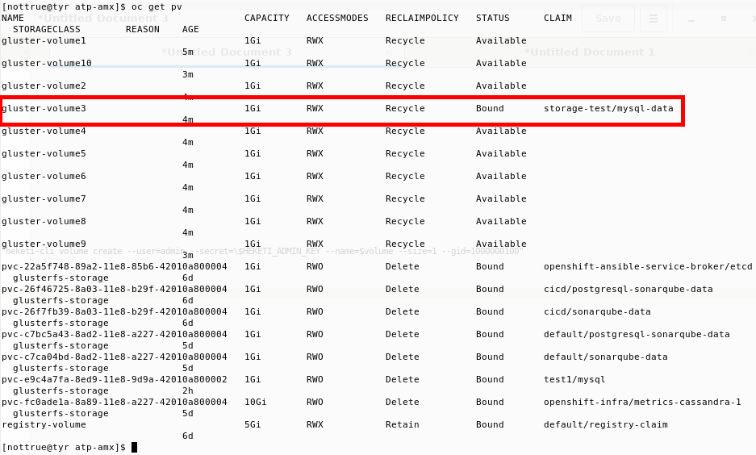

Create the application that will be linked to the volume. initially, an empty filesystem is mounted on the relevant mountpints; in this particular case, /var/lib/mysql/data:

    oc -nstorage-test new-app --name=mysql mysql-ephemeral -p"MYSQL_USER=user" -p"MYSQL_PASSWORD=password" -p"MYSQL_DATABASE=db"    
    oc -nstorage-test patch dc/mysql -p '{"spec":{"template":{"spec":{"securityContext":{"supplementalGroups":[1000000100]}}}}}'

Running **mount** in the container shows an empty filesystem is currently mounted:
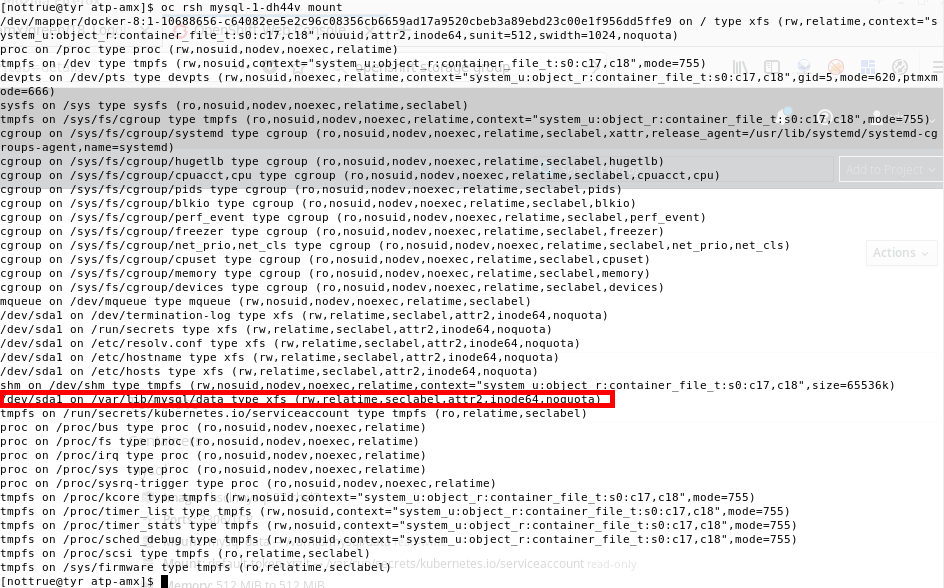

Replacing the empty dir volume mount for the pvc bound to the gluster volume:

    oc -nstorage-test volumes dc/mysql --add -tpvc --name="mysql-data" --claim-name="mysql-data" --overwrite

Checking the volume mount is now linked to the gluster volume:
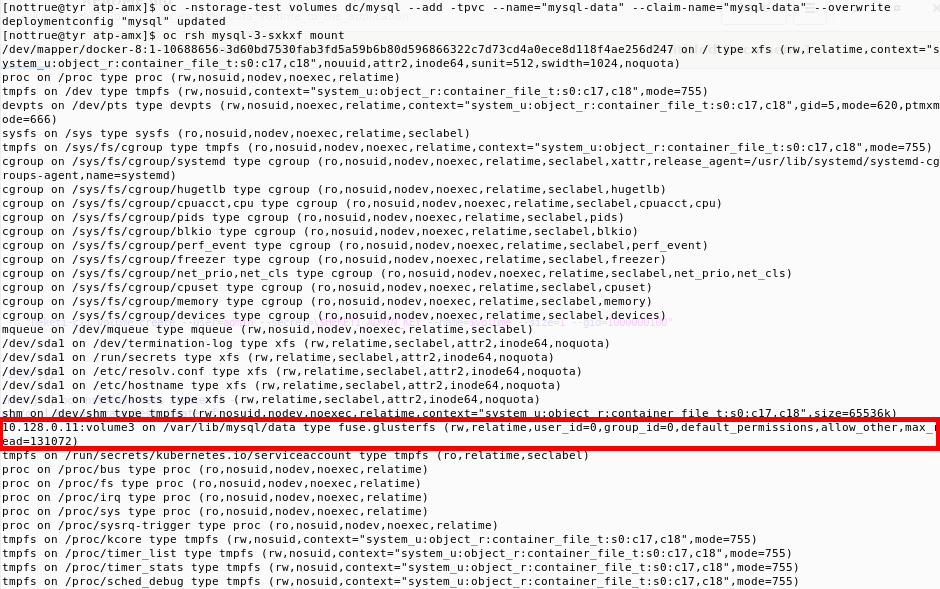

If a specific PV must be linked to a particular pod or set of pods, the PVC may be created specifying the PVC it should bind to.
As long as the PV is not already bound, the PV will be successfully created and linked to the specified PV:

    oc -nstorage-test create -f - << EOF
    apiVersion: v1
    kind: PersistentVolumeClaim
    metadata:
      annotations:
      creationTimestamp: null
      name: named-volume-6
    spec:
      accessModes:
      - ReadWriteMany
      resources:
        requests:
          storage: 1Gi
      storageClassName: ""
      volumeName: gluster-volume6
    EOF

After creating the PVC, both it and the PV should correctly report the binding:
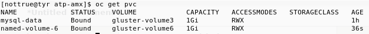
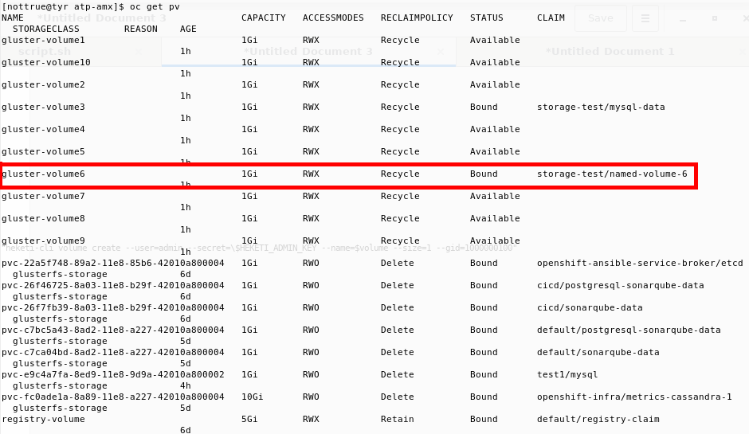
