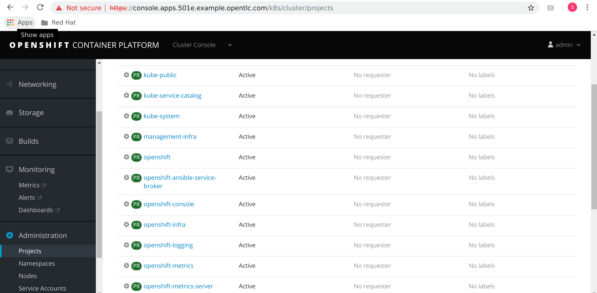
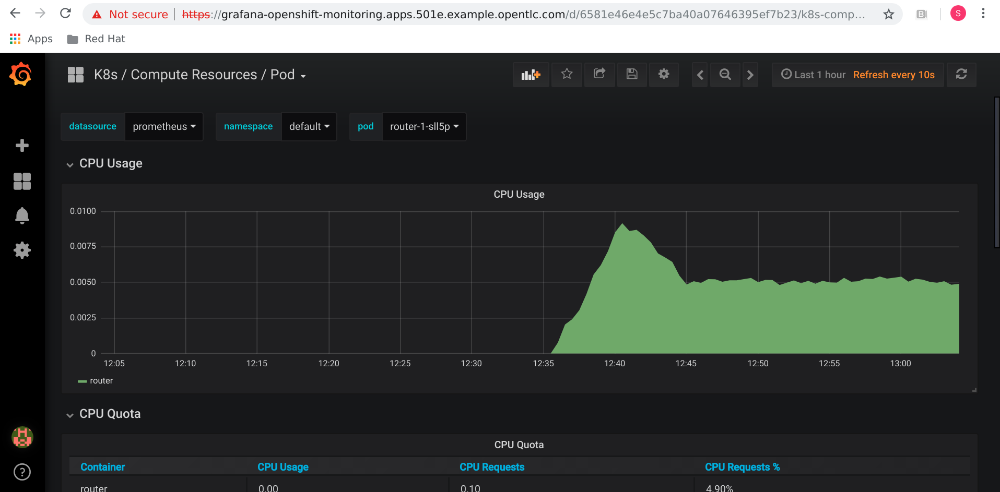

 OpenShift Container Platform ships with a pre-configured and self-updating monitoring stack that is based on the [Prometheus](https://prometheus.io/)open source project and its wider eco-system. It provides monitoring of cluster components and ships with a set of alerts to immediately notify the cluster administrator about any occurring problems and a set of [Grafana](https://grafana.com/) dashboards.

