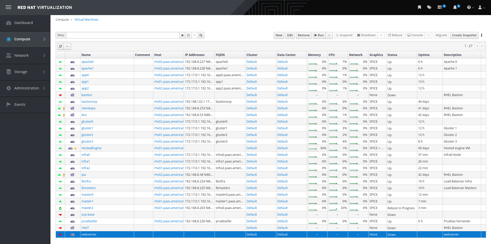
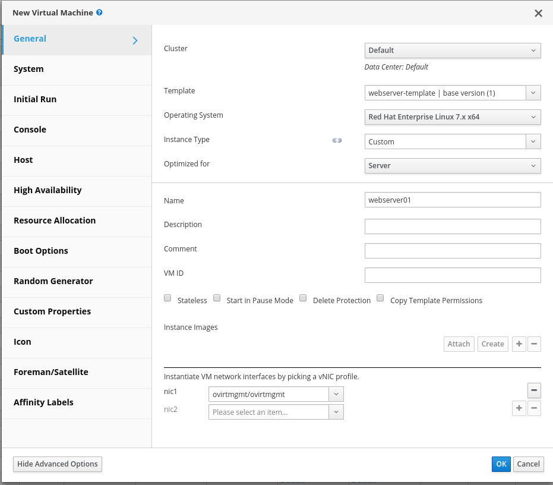
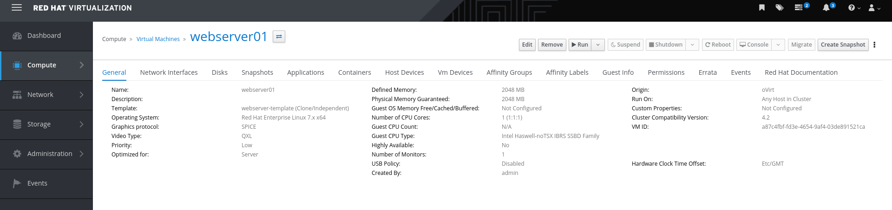
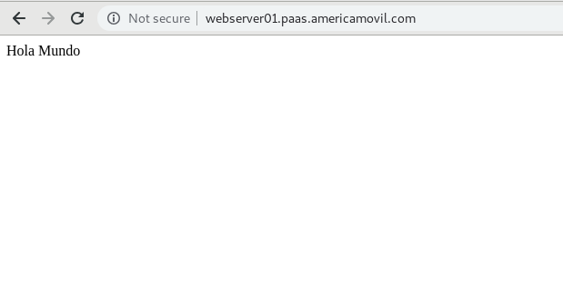

48 Software warehouse management of VM applications

En el dashboard de RHV-Manager ir a Compute --> Virtual Machine

Dar click en New y llenar la información para crear la VM

Validar que la VM fué creada

Abrir la consola de la VM, crear un contenido web y levantar el servicio httpd

En un navegador validar el acceso al contenido web

