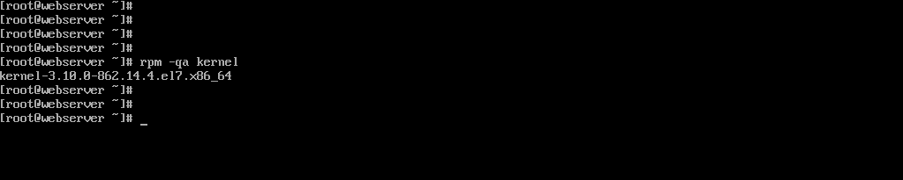
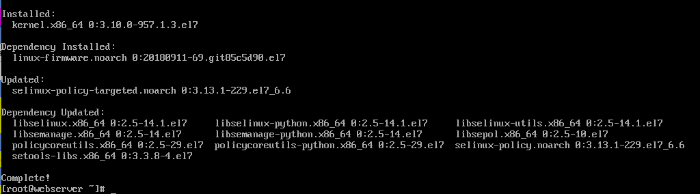
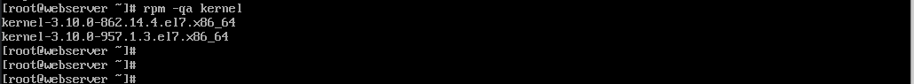
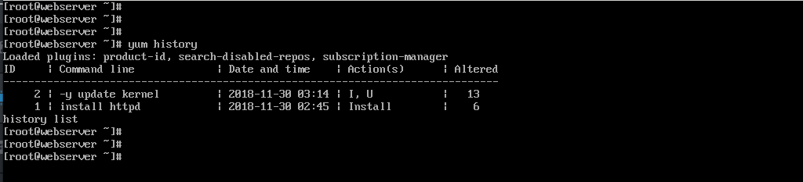

# 49 Software Package and Version Management of VM applications

En la VM revisar la versión actual del kernel

Usar el comando yum -y update kernel para actualizar la versión del kernel a la última disponible

Verificar que se haya actualizado el paquete (deberán estar disponibles las dos versiones)

El comando yum history nos permite mostrar la información de las transacciones de instalación, actualización y eliminación de paquetes

