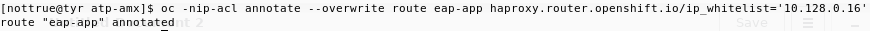
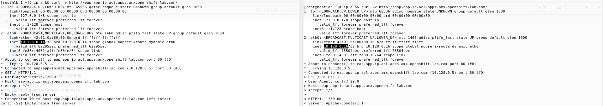
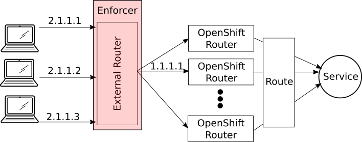

# Cli Way

Annotating a route with

    haproxy.router.openshift.io/ip_whitelist

Allows to specify a set of IP addresses that will be allowed to access a certain route. Requests coming from any and all other adresses will be reset, that is, terminated before content is returned\

For instance, annotating a route as follows will allow 10.128.0.16 to use the route, but not 10.128.0.14\

# Caveats and considerations

Since by using this strategy the OpenShift routers are the infrastructure elements in charge of enforcing the access policies, it will only function properly if the client machines, or the network equipment that will be restricted form using the service, are directly connected to the infrastructure nodes.\

If there is any load balancing or gateway device between the client machines and the infa nodes, all requests will reach the OpenShift routers from only one IP address, and so, the policies will make little sense.\
Thus, if an external load balancer sits between the client machines and the OpenShift infra nodes, it will be this load balancer's responsibility to enforce the policies; and consequently, must be able to restrict IP traffic directed to a specific host name, using either TLS SNI or HTTP headers depending on the traffic\

