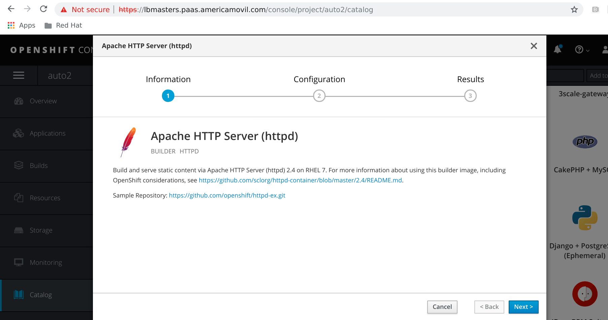
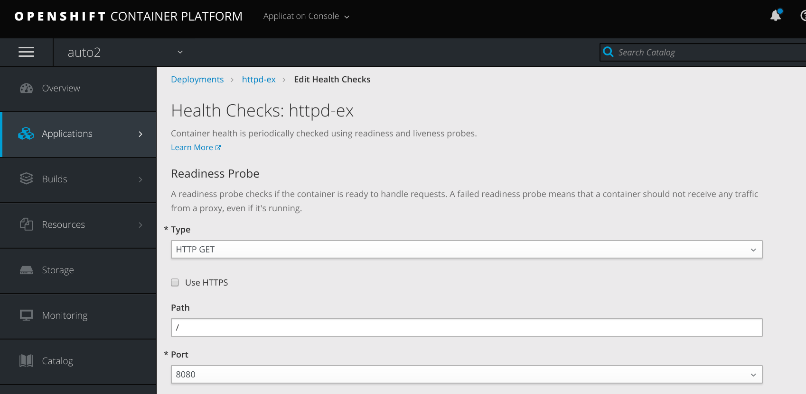
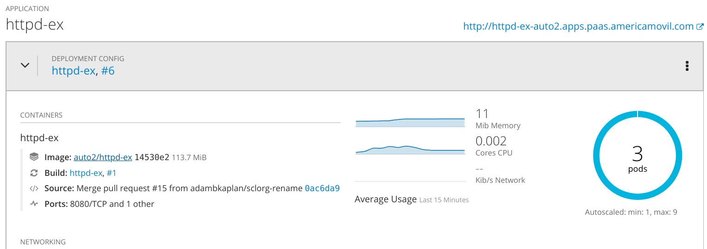
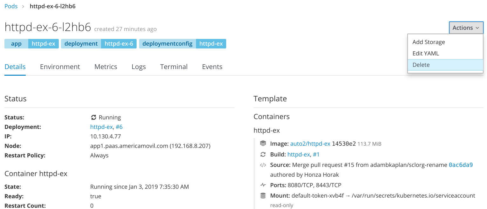
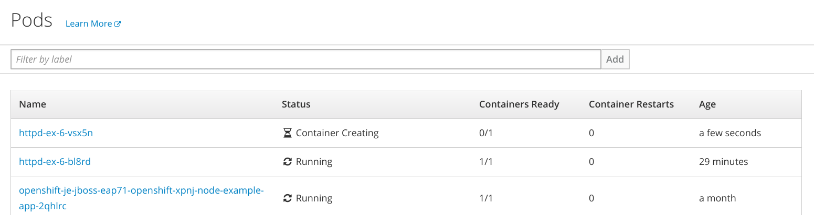

# OpenShift - 62 Application health check and automatic recovery
OpenShift can monitor health of containers with Readiness and Liveness properties.

## How to run this?

Create a frontend project, example httpd.

Then setup health checks:

Setup replicas to 3:

Then try to delete a pod:

See how a new pod is created a few seconds later:

