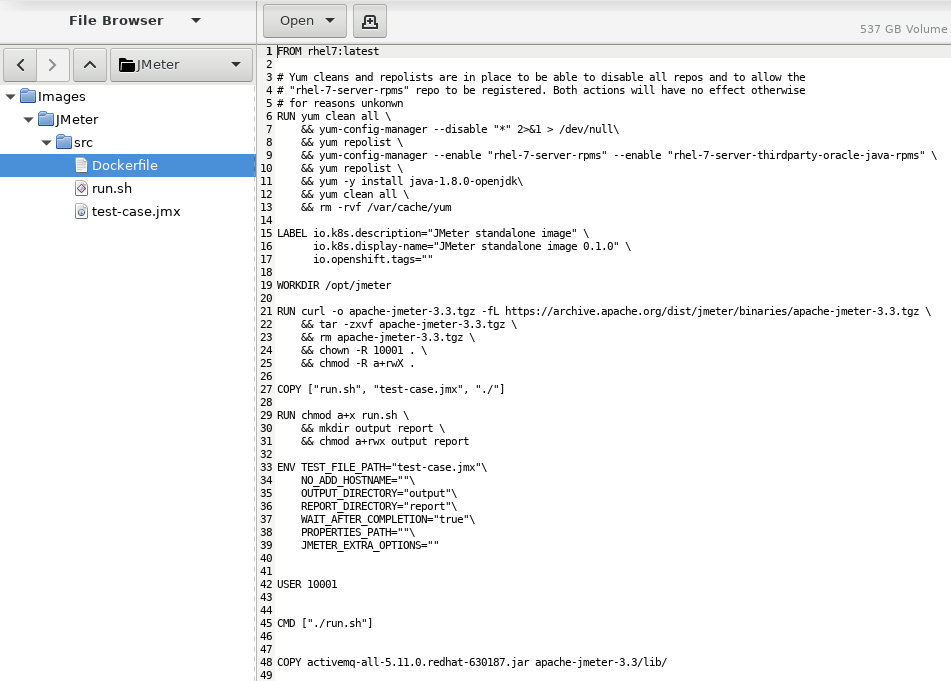
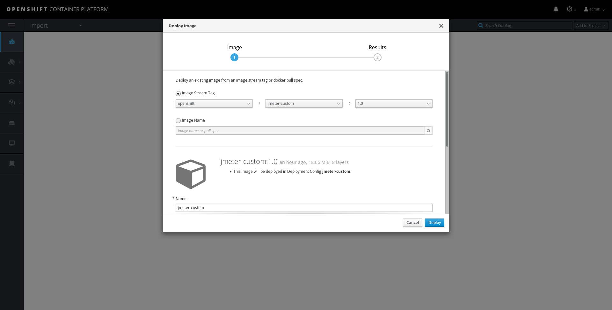
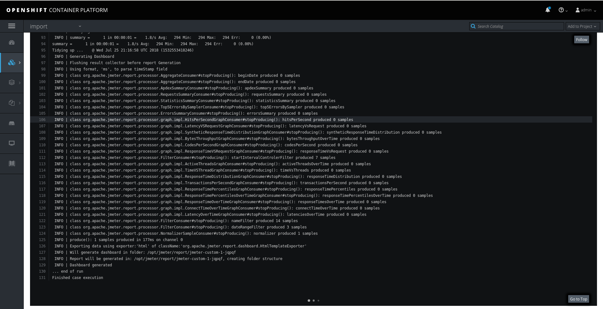

# Importing and instantiating an existing image in OpenShift

Given an application image loaded in a docker daemon, built from a dockerfile such as the following:

The image can be imported in the OpenShift local registry to be instantiated in OpenShift as follows:

## Assuming the docker daemon it resides on cannot or should not connect to the OpenShift registry directly

Export the image as a tar/tar.gz file:

Import the file in a Docker daemon with access to the OpenShift registry. Possibly one of the OpenShfit nodes themselves

## In any case

Login to the registry using the OAuth user and token

Load, tag, and push the image

Check the imagestream was correctly generated

Crete a container using the loaded image

