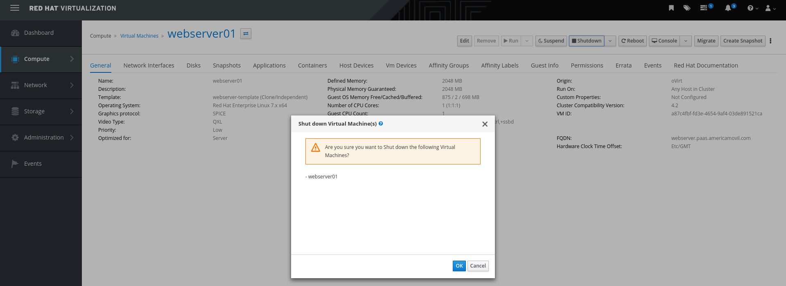

# 19 Life cycle management of VM applications

CloudForms permite la gestión del ciclo de vida de las VMs

Migración: Es posible migrar una VM de un hypervisor a otro sin apagarla

Shutdown: Apaga la VM

Removal: elimina la VM

