# 51 Graphical orchestration of VM applications

Al conectarse a CloudForms se mostrará el Dashboard principal

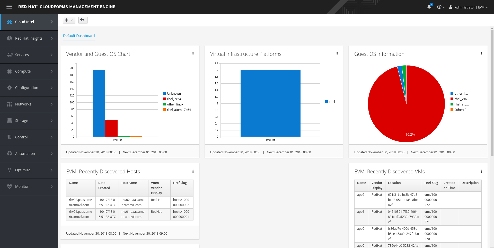

Ir a Compute --> Infrastructure Providers

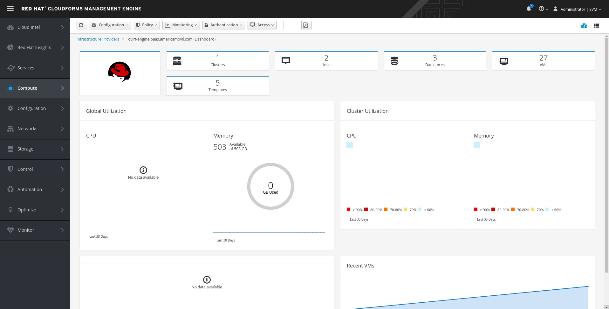

Dar click en New VM y completar los formularios con la información de la VM a crear

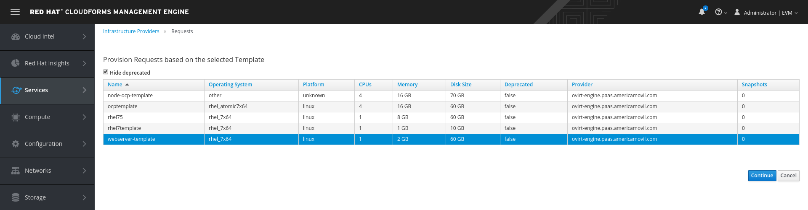

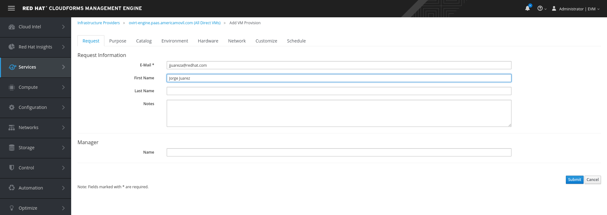

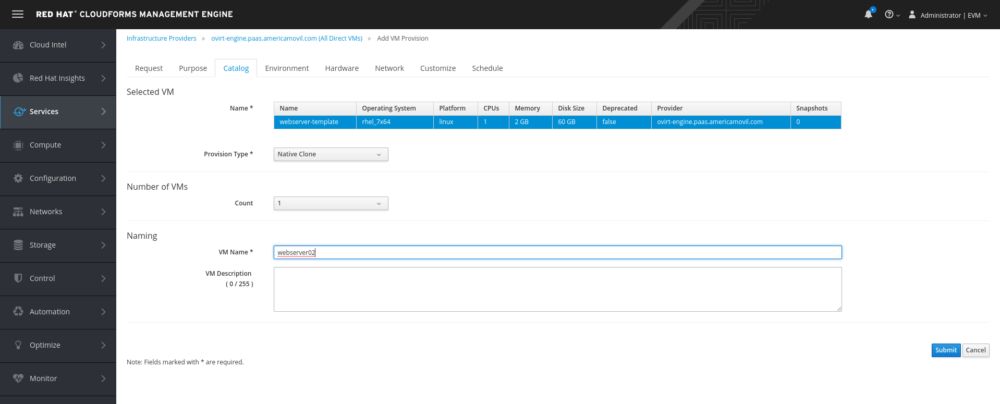

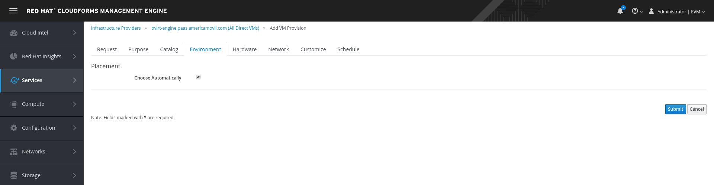

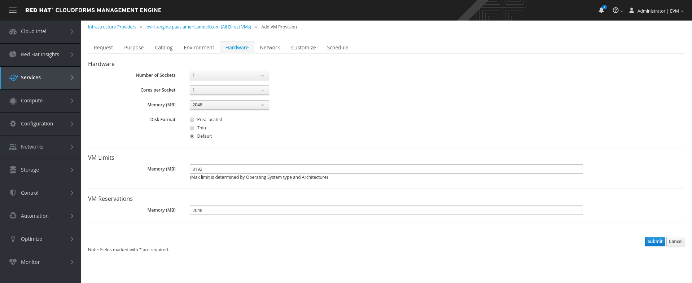

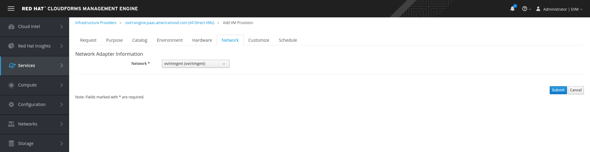

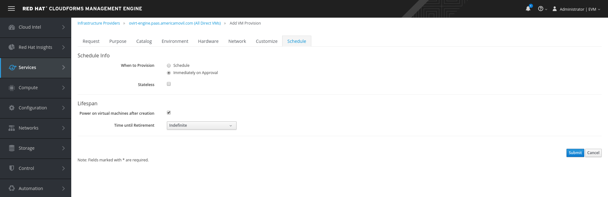

Al finalizar la programación de la creación de la VM se mostrará la información del Request

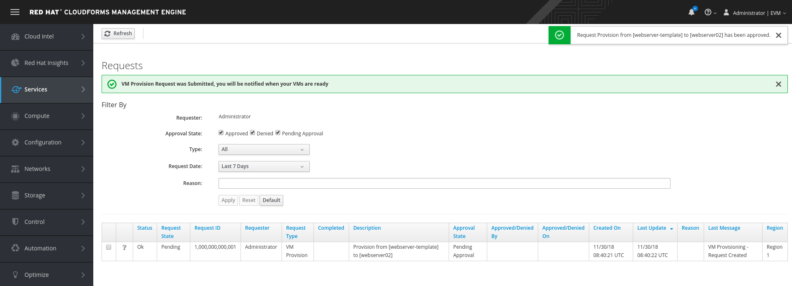

Después de unos minutos se puede verificar la correcta creación de la VM en el Dashboard de RHV-M

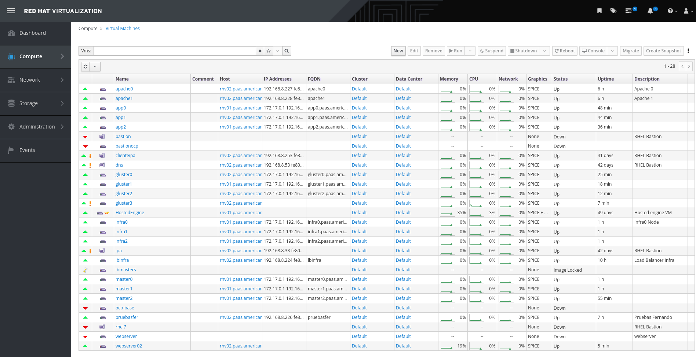

En CloudForms podemos consultar la topología de los componentes de RHV como Infrastructure Provider

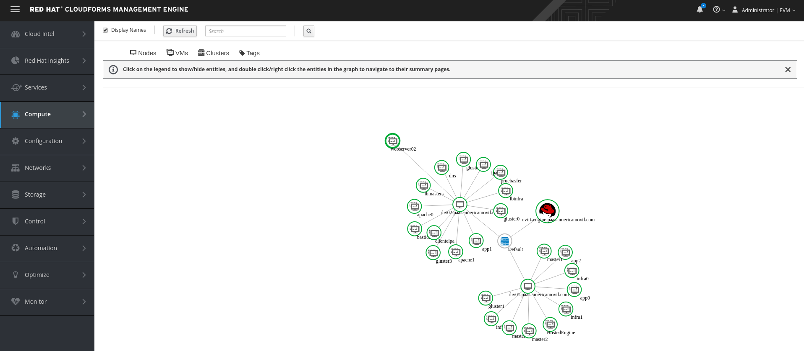

Al dar click sobre la VM veremos sus detalles

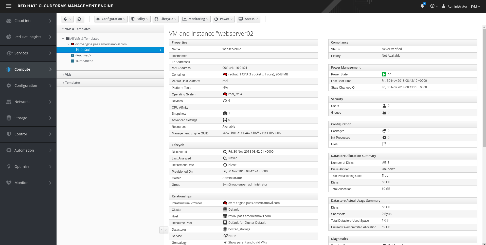

Con CloudForms es posible establecer una fecha de Retirement (eliminación) de la VM

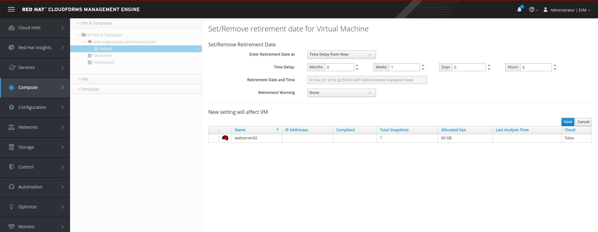

