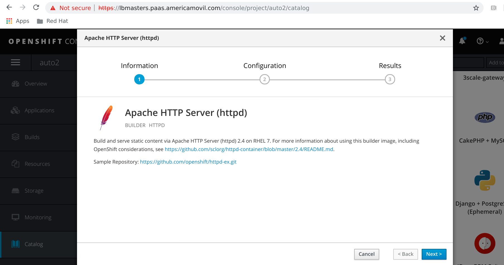
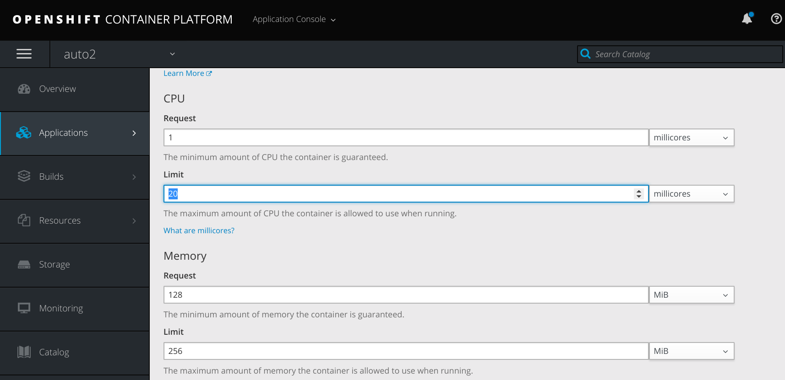
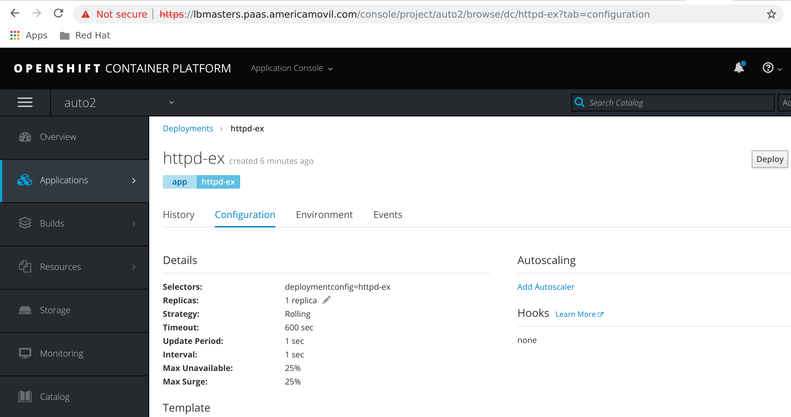
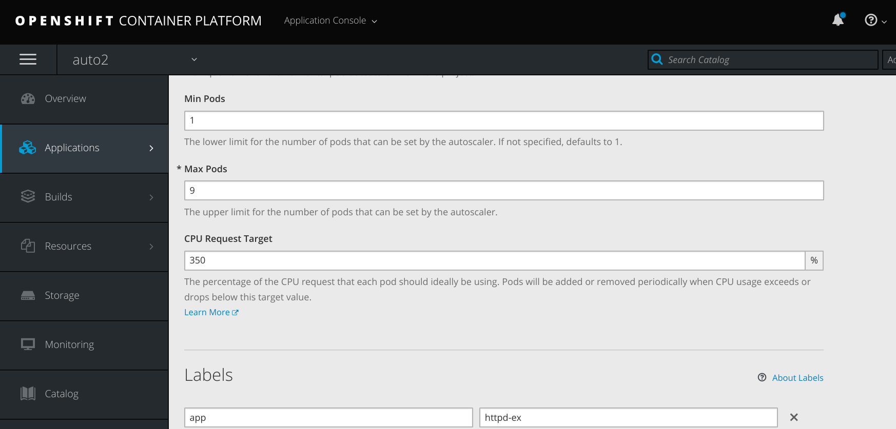
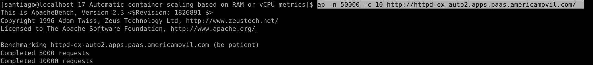
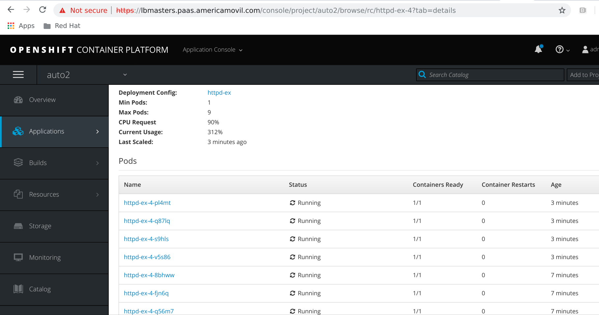

# OpenShift - Autoscaling
OpenShift can manually or automatically scale application pods up and down based on container metrics such as cpu and memory consumption.  

## How to run this?

Create a frontend project, example httpd.

Then setup resource limits:

Then create an autoscaler:

Set autoscale config:

Test:

ab -n 50000 -c 10 http://httpd-ex-auto2.apps.paas.americamovil.com/

And see pod autoscaling:

